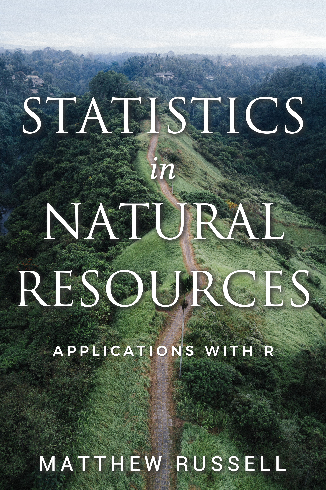

# stats4nr 

This package contains several data sets used in the book *Statistics in Natural Resources: Applications with R*.

Data sets include:

* **ant**: Ant species richness in bogs and forests in New England, USA. *Source*: https://doi.org/10.1890/0012-9658(2002)083[1604:BAARSD]2.0.CO;2 

* **birds**: Bird abundance in west-central California suburbs. *Source*: https://doi.org/10.2307/3038144 

* **butterfly**: Simulated values of butterfly wing lengths.

* **chirps**: Number of chirps that a striped ground cricket makes at different temperatures. *Source*: Pierce (1943). *The songs of insects*

* **cwd**: Coarse woody debris along the shorelines of 16 lakes in the US Great Lakes region. *Source*: https://doi.org/10.2307/2269598

* **elm**: Measurements from 333 cedar elm trees in Austin, Texas. *Source*: https://doi.org/10.1093/jofore/fvaa034

* **falcon**: Simulated values of peregrine falcon wingspan and body measurements.

* **fish**: Measurements on fish (seven species) caught in Lake Laengelmavesi, Finland. *Source*: http://jse.amstat.org/datasets/fishcatch.txt

* **fishing**: Number of fish caught at a state park. *Source*: https://stats.idre.ucla.edu/stat/data/fish.dat

* **iron**: Iron levels in  Chesapeake Bay collected in the 1960s. *Source*: https://doi.org/10.2307/1351176

* **logging**: Tree species diversity after logging operations in Bornean forests. *Source*: https://doi.org/10.1126/science.281.5381.1366

* **moths**: Spruce moths found in traps placed in four different locations in trees with different lures. *Source*: Brase and Brase (2017).  *Understandable statistics: concepts and methods, 11th ed.*

* **redpine**: Red pine tree measurements from Cloquet, MN. *Source*: https://conservancy.umn.edu/handle/11299/214889

* **trupp**: Measurements of oak seedlings planted for browse protection in Cloquet, MN. (Unpublished data). 

## Installation

Installing the package provides access to these data sets. You can install the development version from GitHub using the **devtools** package:

```R
# install.packages("devtools")

devtools::install_github("mbrussell/stats4nr")
```
